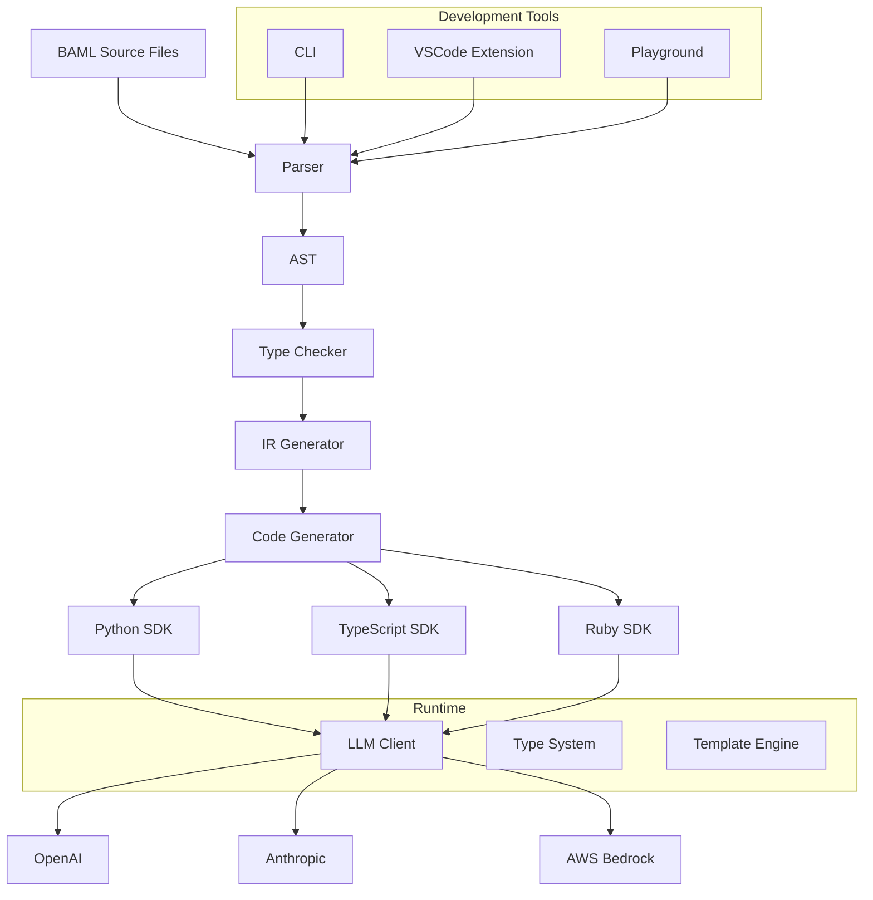
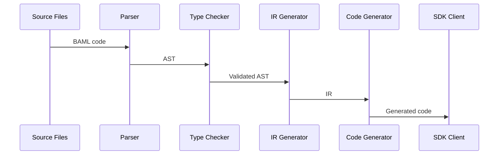
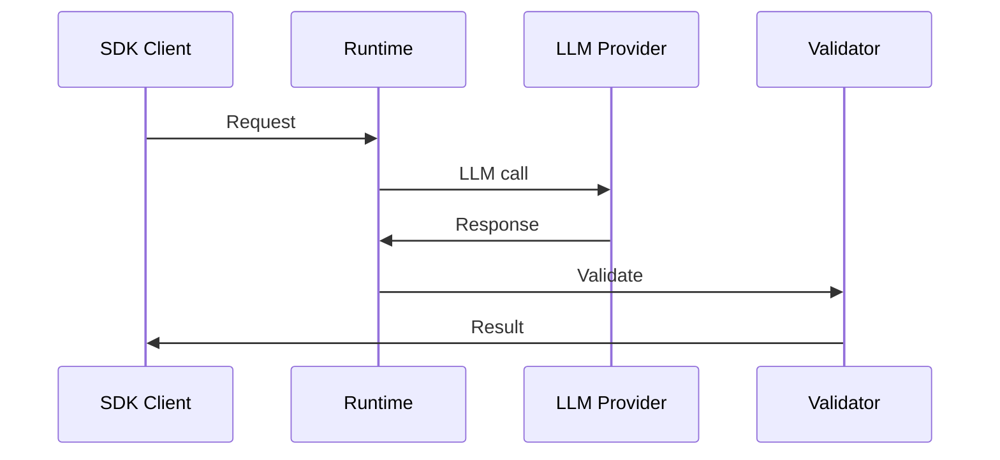

# BAML Architecture

> **⚠️ IMPORTANT NOTE**
>
> This document was initially generated by an AI assistant and should be taken with a grain of salt. While it provides a good starting point, some information might be inaccurate or outdated. We encourage contributors to manually update this document and remove this note once the content has been verified and corrected by the team.
>
> If you find any inaccuracies or have improvements to suggest, please feel free to submit a PR updating this guide.

BAML is designed as a modular system that transforms BAML source files into type-safe SDKs for multiple programming languages while providing runtime support for LLM interactions.

## System Overview



## Core Components

### 1. Compiler Frontend (`baml-lib/baml/`)
- **Parser**: Converts BAML source files into AST
- **Type Checker**: Validates types and relationships
- **IR Generator**: Creates intermediate representation

### 2. Type System (`baml-lib/baml-types/`)
- Type definitions and validation
- Runtime value representation
- Schema compatibility checking

### 3. Code Generator (`language_client_codegen/`)
- Language-specific code generation
- Type mapping for each language
- SDK structure generation

### 4. Runtime (`baml-runtime/`)
- LLM provider integrations
- Request handling and validation
- Response processing
- Error management

### 5. Language Clients
- Native language bindings
- Type-safe interfaces
- Async/await support
- Error handling

### 6. Development Tools
- CLI for project management
- VSCode extension for development
- Web playground for testing

## Data Flow

1. **Compilation Phase**
   ```
   BAML Source → AST → IR → Generated Code
   ```

2. **Runtime Phase**
   ```
   Client Call → Runtime → LLM Provider → Response → Type Validation → Result
   ```

3. **Development Phase**
   ```
   Edit → Validate → Preview → Test → Generate
   ```

## Key Design Decisions

### 1. Type Safety
- Strong type system for LLM outputs
- Runtime validation of responses
- Language-specific type generation

### 2. Modularity
- Separate compiler and runtime
- Pluggable LLM providers
- Language-agnostic core

### 3. Developer Experience
- Rich error messages
- Interactive development tools
- Comprehensive testing support

### 4. Performance
- Efficient code generation
- Optimized runtime
- Smart caching

## Component Interactions

### 1. Compilation Process


### 2. Runtime Flow


## Code Generation

The BAML compiler generates type-safe client libraries for multiple programming languages. For a detailed explanation of the code generation process, see our [Code Generation Guide](code-generation.md).

## Extension Points

### 1. Adding LLM Providers
- Implement provider trait
- Add configuration options
- Create integration tests

### 2. New Language Support
- Create code generator
- Implement type mappings
- Add runtime bindings

### 3. Custom Features
- Extend type system
- Add compiler passes
- Create runtime middleware

## Performance Considerations

### 1. Compilation
- Incremental compilation
- Parallel code generation
- Smart caching

### 2. Runtime
- Connection pooling
- Response streaming
- Efficient validation

### 3. Development
- Fast feedback loop
- Intelligent caching
- Optimized previews

## Security

### 1. API Key Management
- Environment variables
- Secure configuration
- Key rotation support

### 2. Request/Response
- Input validation
- Output sanitization
- Error handling

### 3. Development
- Safe defaults
- Security checks
- Audit logging

## Future Directions

### 1. Planned Features
- More language support
- Additional LLM providers
- Enhanced type system

### 2. Optimization Opportunities
- Smarter caching
- Better parallelization
- Reduced memory usage

### 3. Tool Improvements
- Enhanced IDE support
- Better debugging tools
- More development features

## Resources

- [Engine Documentation](../engine/README.md)
- [Type System Guide](../engine/baml-lib/baml-types/README.md)
- [Runtime Guide](../engine/baml-runtime/README.md)
- [CLI Documentation](../engine/cli/README.md)
