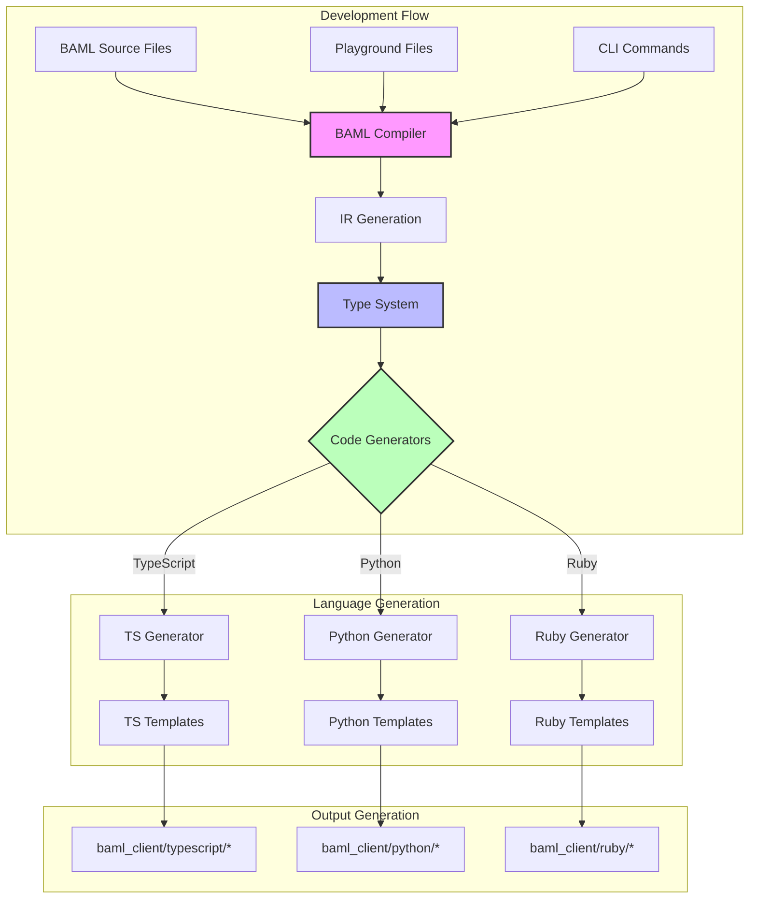

# BAML Code Generation Guide

This guide explains how BAML's code generation process works, from BAML source files to generated client libraries. This is essential knowledge for both contributors and users of BAML.

## Overview



## Generation Sources

BAML code can be generated from multiple sources:

1. **BAML Source Files** (`*.baml`)
   - Main source of truth for your BAML definitions
   - Located in your project's source directory
   - Version controlled with your project

2. **Playground Files**
   - Quick experimentation and testing
   - Generated from the BAML playground
   - Temporary/development use

3. **CLI Commands**
   - Direct generation through BAML CLI
   - CI/CD pipeline integration
   - Automated builds

## Generated Output Structure

When BAML generates code, it creates a `baml_client` directory with the following structure:

```
baml_client/
├── typescript/
│   ├── types.ts          # Generated TypeScript types and interfaces
│   ├── client.ts         # Main client implementation
│   ├── functions/        # Generated function implementations
│   │   ├── function1.ts  # Each BAML function gets its own file
│   │   └── function2.ts
│   └── utils/           # Helper utilities and shared code
├── python/
│   ├── types.py         # Generated Python types (Pydantic models)
│   ├── client.py        # Main client implementation
│   ├── functions/       # Generated function implementations
│   │   ├── function1.py
│   │   └── function2.py
│   └── utils/          # Helper utilities
└── ruby/               # Similar structure for Ruby
```

## Generation Process

1. **Parsing & Validation**
   - BAML source files are parsed into an AST
   - Type checking and validation occurs
   - Dependencies are resolved

2. **IR Generation**
   - AST is converted to Intermediate Representation (IR)
   - Platform-independent representation
   - Optimizations are applied

3. **Type System Processing**
   - Types are resolved and validated
   - Cross-reference checking
   - Type mappings are prepared

4. **Code Generation**
   - Language-specific generators are invoked
   - Templates are applied
   - Output files are created

## Generation Commands

### Basic Generation

```bash
# Generate from source directory
baml generate --from ./src

# Generate with custom output
baml generate --from ./src --out ./custom_client

# Generate with specific language
baml generate --from ./src --lang typescript
```

### Playground Generation

```bash
# Generate from playground
baml playground generate

# Generate with config
baml playground generate --config ./playground.config.json
```

### Watch Mode

```bash
# Watch for changes and regenerate
baml generate --from ./src --watch

# Watch with custom config
baml generate --from ./src --watch --config ./baml.config.json
```

## Generated Components

Each generated client includes:

1. **Type Definitions**
   - Data models and enums
   - Request/Response types
   - Validation schemas
   - Language-specific type mappings

2. **Client Implementation**
   - Authentication handling
   - Request processing
   - Error handling
   - Retry logic
   - Streaming support

3. **Function Implementations**
   - Type-safe function wrappers
   - Input validation
   - Response parsing
   - Error handling
   - Documentation

4. **Utilities**
   - Helper functions
   - Type conversions
   - Common operations
   - Shared code

## Best Practices

1. **Version Control**
   - Always commit generated code
   - Keep generation commands in build scripts
   - Document any custom generation steps

2. **Code Organization**
   - Keep BAML files in a dedicated directory
   - Use consistent naming conventions
   - Group related functions together

3. **Generated Code**
   - Never manually edit generated files
   - Use BAML features instead of post-generation modifications
   - Keep generated code in sync with source

4. **Development Flow**
   - Use watch mode during development
   - Regularly test generated code
   - Keep client libraries updated

## Common Issues and Solutions

1. **Generation Failures**
   - Check BAML syntax
   - Verify file paths
   - Check for circular dependencies
   - Enable debug logging

2. **Type Errors**
   - Review type definitions
   - Check for missing imports
   - Verify type mappings

3. **Runtime Issues**
   - Check generated code
   - Verify environment setup
   - Review error handling

## Language-Specific Details

### TypeScript
- Uses native TypeScript types
- Includes ESM and CommonJS support
- Full type inference
- React/Next.js integration

### Python
- Uses Pydantic models
- Async/await support
- Type hints
- Package management

### Ruby
- Native Ruby types
- Gem packaging
- ActiveRecord integration
- Rails support

## Contributing

To add support for a new language:

1. Create language generator in `engine/language_client_codegen/src`
2. Add templates in `engine/language_client_codegen/templates`
3. Implement type mappings
4. Add tests
5. Update documentation

See [CONTRIBUTING.md](../CONTRIBUTING.md) for detailed contribution guidelines.