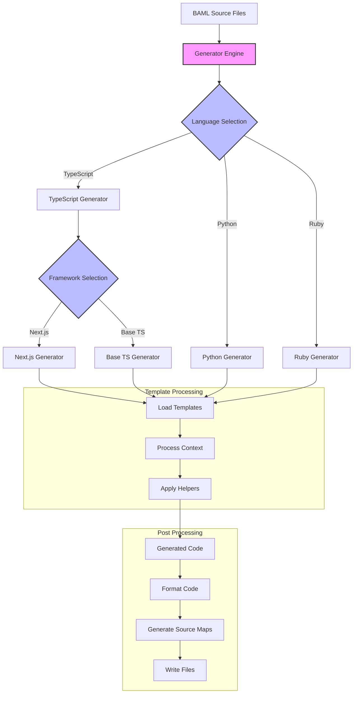

# BAML Code Generator

> **⚠️ IMPORTANT NOTE**
>
> This document was initially generated by an AI assistant and should be taken with a grain of salt. While it provides a good starting point, some information might be inaccurate or outdated. We encourage contributors to manually update this document and remove this note once the content has been verified and corrected by the team.
>
> If you find any inaccuracies or have improvements to suggest, please feel free to submit a PR updating this guide.

The BAML Code Generator is responsible for generating type-safe language-specific client SDKs from BAML source files. It provides a flexible template-based system for adding support for new languages and customizing code generation.

## Features

- Template-based code generation
- Multi-language support
- Type-safe code generation
- Customizable templates
- Incremental generation
- Source map support
- Formatting integration

## Code Generation Flow



### Flow Explanation

1. **Input Processing**
   - BAML source files are read
   - AST is generated and validated

2. **Generator Selection**
   - Language-specific generator is chosen
   - Framework-specific generator is selected if applicable

3. **Template Processing**
   - Templates are loaded based on language/framework
   - Context is prepared with types and metadata
   - Helper functions are applied

4. **Code Generation**
   - Templates are rendered with context
   - Language-specific formatting is applied
   - Source maps are generated
   - Files are written to disk

## Architecture

### Components

```
language_client_codegen/
├── src/
│   ├── generator/         # Core generator implementation
│   │   ├── engine.rs      # Generation engine
│   │   ├── context.rs     # Template context
│   │   └── types.rs       # Type system
│   ├── languages/         # Language-specific generators
│   │   ├── python/        # Python generator
│   │   ├── typescript/    # TypeScript generator
│   │   │   ├── mod.rs     # Main TypeScript generator
│   │   │   ├── next/      # Next.js specific generation
│   │   │   └── types.rs   # TypeScript type mappings
│   │   └── ruby/          # Ruby generator
│   └── templates/         # Template definitions
│       ├── python/        # Python templates
│       ├── typescript/    # TypeScript templates
│       │   ├── base/      # Base TypeScript templates
│       │   └── next/      # Next.js specific templates
│       └── ruby/          # Ruby templates
├── templates/             # Template files
└── examples/              # Example generators
```

### Core Concepts

1. **Generator Engine**
   - Template processing
   - Context management
   - File generation
   - Framework-specific output (e.g., Next.js, Express)

2. **Type System**
   - Language mappings
   - Type conversion
   - Validation rules
   - Framework-specific types

3. **Templates**
   - Language templates
   - Framework templates (e.g., Next.js Server Actions)
   - Partial templates
   - Helper functions

## Framework Support

### Next.js Integration

The generator supports Next.js-specific code generation, including React Server Actions:

```typescript
// Example generated Next.js Server Action
'use server'

import { baml } from '@/lib/baml'

export async function myBamlFunction(input: MyInputType) {
  return await baml.functions.myFunction(input)
}
```

To enable Next.js generation:

1. Configure TypeScript generator with Next.js options:
```rust
let config = TypeScriptConfig {
    framework: Some(Framework::NextJs),
    server_actions: true,
    ..Default::default()
};
```

2. Use Next.js specific templates:
```rust
generator
    .with_template("next/server-action", server_action_template)
    .with_template("next/client-wrapper", client_wrapper_template);
```

3. Generate code:
```rust
generator
    .generate("path/to/baml/files", "app/lib/baml")
    .await?;
```

### Template Structure

Next.js templates should follow this structure:

```
templates/typescript/next/
├── server-actions.ts.j2    # Server Action templates
├── client-wrapper.ts.j2    # Client-side wrapper
└── types.ts.j2            # Next.js specific types
```

Example server action template:
```handlebars
'use server'

import { baml } from '@/lib/baml'
import type { {{type_name}} } from './types'

export async function {{function_name}}(
  input: {{input_type}}
): Promise<{{output_type}}> {
  return await baml.functions.{{original_name}}(input)
}
```

## Usage

### Basic Example

```rust
use baml_codegen::{Generator, Config};

#[tokio::main]
async fn main() -> Result<(), Box<dyn Error>> {
    // Initialize generator
    let generator = Generator::new(Config::default())?;

    // Generate code
    generator
        .generate("path/to/baml/files", "output/dir")
        .await?;

    Ok(())
}
```

### Custom Template

```rust
use baml_codegen::template::{Template, Context};

let template = Template::new()
    .with_content(
        r#"
class {{name}} {
    {{#each fields}}
    {{type}} {{name}};
    {{/each}}
}
"#,
    )
    .with_helpers(helpers);

generator.register_template("class", template);
```

### Language Support

```rust
use baml_codegen::language::{Language, TypeMapper};

struct MyLanguage;

impl Language for MyLanguage {
    fn name(&self) -> &str {
        "mylang"
    }

    fn file_extension(&self) -> &str {
        "ml"
    }

    fn type_mapper(&self) -> &dyn TypeMapper {
        &MY_TYPE_MAPPER
    }
}

generator.add_language(Box::new(MyLanguage));
```

## Development

### Prerequisites

- Rust toolchain
- Language formatters
- Template engine

### Setup

```bash
# Install dependencies
cargo build

# Run tests
cargo test

# Run examples
cargo run --example custom_generator
```

## Adding Features

### 1. New Language Support

1. Create language module:
```rust
// src/languages/mylang/mod.rs

use crate::language::{Language, TypeMapper};

pub struct MyLanguage {
    config: LanguageConfig,
}

impl Language for MyLanguage {
    fn name(&self) -> &str {
        "mylang"
    }

    fn generate_type(&self, type_def: &TypeDef) -> Result<String> {
        // Implementation
    }

    fn generate_client(&self, client_def: &ClientDef) -> Result<String> {
        // Implementation
    }
}
```

2. Add type mappings:
```rust
// src/languages/mylang/types.rs

pub struct MyTypeMapper;

impl TypeMapper for MyTypeMapper {
    fn map_type(&self, baml_type: &BamlType) -> Result<String> {
        match baml_type {
            BamlType::String => Ok("string".to_string()),
            BamlType::Int => Ok("int".to_string()),
            // ... other mappings
        }
    }
}
```

### 2. New Template Helper

1. Create helper function:
```rust
// src/helpers/custom_helper.rs

pub fn format_type(
    h: &Helper,
    _: &Handlebars,
    ctx: &Context,
) -> Result<String> {
    let type_name = h
        .param(0)
        .and_then(|v| v.value().as_str())
        .ok_or_else(|| Error::missing_param("type_name"))?;

    Ok(format_type_name(type_name))
}
```

2. Register helper:
```rust
let mut handlebars = Handlebars::new();
handlebars.register_helper("format_type", Box::new(format_type));
```

### 1. New Framework Support

1. Create framework module:
```rust
// src/languages/typescript/frameworks/my_framework/mod.rs

use crate::framework::{Framework, FrameworkGenerator};

pub struct MyFramework {
    config: FrameworkConfig,
}

impl Framework for MyFramework {
    fn name(&self) -> &str {
        "my_framework"
    }

    fn generate_endpoint(&self, endpoint_def: &EndpointDef) -> Result<String> {
        // Implementation
    }

    fn generate_client(&self, client_def: &ClientDef) -> Result<String> {
        // Implementation
    }
}
```

2. Add framework-specific templates:
```
templates/typescript/my_framework/
├── endpoint.ts.j2
├── client.ts.j2
└── types.ts.j2
```

3. Register framework:
```rust
generator.register_framework("my_framework", Box::new(MyFramework::new(config)));
```

## Testing

### Unit Tests

```rust
#[cfg(test)]
mod tests {
    use super::*;

    #[test]
    fn test_type_generation() {
        let generator = setup_test_generator();
        let type_def = test_type_definition();
        let result = generator.generate_type(&type_def).unwrap();
        assert_eq!(result, expected_output());
    }
}
```

### Integration Tests

```rust
#[test]
fn test_full_generation() {
    let generator = Generator::new(test_config()).unwrap();
    let result = generator
        .generate_all("test/fixtures", "test/output")
        .unwrap();
    assert!(result.is_success());
}
```

## Templates

### Basic Template

```handlebars
class {{name}} {
    {{#each fields}}
    private {{type}} {{name}};

    public {{type}} get{{capitalize name}}() {
        return this.{{name}};
    }

    public void set{{capitalize name}}({{type}} {{name}}) {
        this.{{name}} = {{name}};
    }
    {{/each}}
}
```

### Partial Template

```handlebars
{{#*inline "field_declaration"}}
private {{type}} {{name}};
{{/inline}}

class {{name}} {
    {{#each fields}}
    {{> field_declaration}}
    {{/each}}
}
```

## Best Practices

1. **Template Organization**
   - Use partial templates
   - Keep templates modular
   - Use consistent naming

2. **Type Safety**
   - Validate input types
   - Handle edge cases
   - Add type assertions

3. **Code Quality**
   - Format generated code
   - Add source maps
   - Include comments

4. **Testing**
   - Test all generators
   - Verify output
   - Check edge cases

## Contributing

1. Read [Contributing Guide](../../CONTRIBUTING.md)
2. Follow code generation guidelines
3. Add tests for new features
4. Update documentation
5. Submit PR for review
