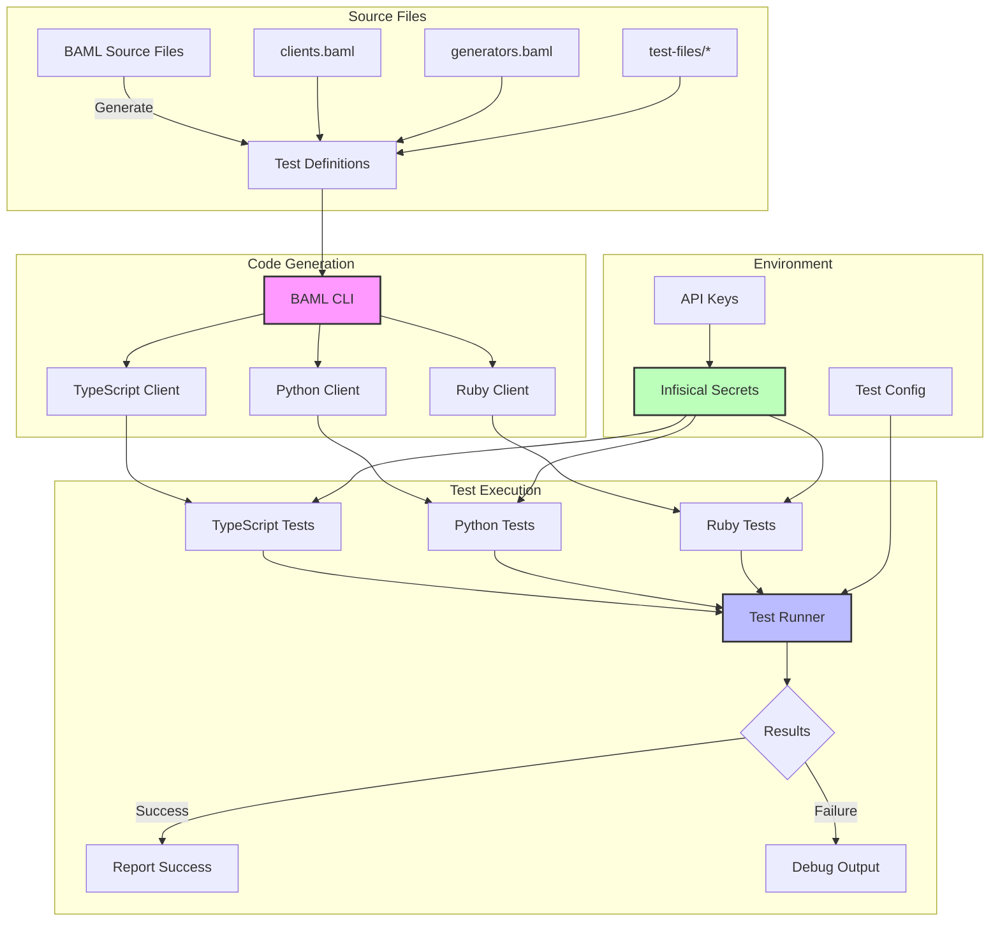

# BAML Integration Tests

This directory contains integration tests for all BAML client libraries. These tests verify that BAML's functionality works correctly across different programming languages.

## Testing Architecture



## What's Being Tested?

The integration tests verify:
1. Code generation for each language
2. API client functionality
3. Type safety and error handling
4. Cross-language consistency

Each language directory (`typescript/`, `python/`, `ruby/`) contains similar tests to ensure consistent behavior across all supported languages.

- [TypeScript](./typescript/README.md)
- [Python](./python/README.md)
- [Ruby](./ruby/README.md)

## Project Structure

```
integ-tests/
├── baml_src/          # BAML source files and test definitions
│   ├── clients.baml   # Main client definitions
│   ├── generators.baml # Reusable test patterns
│   └── test-files/    # Organized test cases
├── typescript/        # TypeScript integration tests
├── python/           # Python integration tests
├── ruby/             # Ruby integration tests
├── openapi/          # OpenAPI integration tests
└── run-tests.sh      # Script to run all tests
```

## Prerequisites

### Required for All Languages
- VSCode with [BAML Extension](https://docs.boundaryml.com/guide/installation-editors/vs-code-extension)
- Rust toolchain (for building native clients)

### Language-Specific Requirements
- **TypeScript**: [Node.js](https://nodejs.org/en/download) and [pnpm](https://pnpm.io/installation)
- **Python**: [Python 3.8+](https://www.python.org/downloads/) and [Poetry](https://python-poetry.org/docs/#installation)
- **Ruby**: [mise](https://mise.jdx.dev/getting-started.html) (via [Homebrew](https://brew.sh))

## Quick Start

1. Install the BAML VSCode extension and CLI:
[BAML CLI](https://docs.boundaryml.com/guide/installation-language)

## Getting Started

### 1. Initial Setup

First, clone the repository and navigate to the integration tests:
```bash
git clone https://github.com/boundaryml/baml.git
cd baml/integ-tests
```

### 2. Install Prerequisites

You'll need the following tools installed:

```bash
# Install Rust (required for building native clients)
curl --proto '=https' --tlsv1.2 -sSf https://sh.rustup.rs | sh

# Install Node.js and pnpm (for TypeScript tests)
brew install node
npm install -g pnpm

# Install Python 3.8+ and Poetry (for Python tests)
brew install python@3.8
curl -sSL https://install.python-poetry.org | python3 -

# Install mise for Ruby (for Ruby tests)
brew install mise
```

### 3. Environment Setup

We use Infisical (a secrets management tool) to handle test credentials. You have two options:

a. **Using Infisical (Recommended for team members)**
   1. Install Infisical:
      ```bash
      brew install infisical
      ```
   2. Ask a team member for access to the Infisical workspace
   3. Login to Infisical:
      ```bash
      infisical login
      ```

b. **Using .env File (Recommended for open source contributors)**
   1. Create a `.env` file in the `integ-tests` directory
   2. Add the following required variables (ask maintainers for test API keys if needed):
      ```bash
      OPENAI_API_KEY=your_test_key_here
      ANTHROPIC_API_KEY=your_test_key_here
      # Add other required keys as needed
      ```

### 4. Set Up Environment Variables
   Choose one of these methods:

   a. **Using Infisical (Recommended)**
      ```bash
      infisical run --env=test -- [test command]
      ```

   b. **Using .env Files**
      - Create a `.env` file in the root directory
      - Run tests without Infisical

### 5. Write BAML Tests
   - Add test cases in appropriate BAML files
   - Use generators for common patterns
   - Follow best practices in BAML Source README

### 6. Generate Client Code and Run Tests
   Choose your language:

   a. **TypeScript**
      ```bash
      # Build the debug version of the client
      cd typescript && pnpm run build:debug

      # Generate the test code
      pnpm run generate

      # Run tests with Infisical (recommended)
      pnpm run integ-tests

      # Or run tests with .env file
      pnpm run integ-tests:dotenv
      ```

   b. **Python**
      ```bash
      cd python

      # Install dependencies
      poetry install

      # Build the client library
      poetry run maturin develop --manifest-path ../../engine/language_client_python/Cargo.toml

      # Generate the test code
      poetry run baml-cli generate --from ../baml_src

      # Run tests with Infisical (recommended)
      infisical run --env=test -- poetry run pytest

      # Or run tests with .env file
      poetry run pytest
      ```

   c. **Ruby**
      ```bash
      cd ruby

      # Install dependencies
      bundle install

      # Build and generate code
      rake generate

      # Run tests with Infisical (recommended)
      infisical run --env=test -- rake test

      # Or run tests with .env file
      rake test
      ```

### 7. Update Client Libraries (Optional)
   ```bash
   baml update-client
   ```

### 8. Run All Tests
   - Use language-specific test commands (see above)
   - Or run all tests with `./run-tests.sh`

## Debugging

Each language has its own debugging setup in VSCode:

- **TypeScript**: [Jest Runner](https://marketplace.visualstudio.com/items?itemName=firsttris.vscode-jest-runner) extension
- **Python**: [Python Test Explorer](https://marketplace.visualstudio.com/items?itemName=LittleFoxTeam.vscode-python-test-adapter)
- **Ruby**: [Ruby Test Explorer](https://marketplace.visualstudio.com/items?itemName=connorshea.vscode-ruby-test-adapter)

See individual language READMEs for detailed debugging instructions.

### Testing the Playground

To test the BAML VSCode extension playground:
1. Open the `root-wasm32.code-workspace` file in VSCode
2. Navigate to the TypeScript directory in the workspace explorer
3. Use the Run and Debug view (F5)
4. Select "Launch VS Code extension" to start the playground
5. A new VSCode window will open with the BAML extension in development mode

> **Important**: Make sure to open the workspace file as it contains necessary VSCode settings and extensions for development.

For more detailed instructions on running the playground, see the [TypeScript README](./typescript/README.md).

## Common Issues

1. **Client Generation Failures**
   - Ensure BAML CLI is up to date
   - Verify BAML source files in `baml_src/`
   - Check language-specific client generation logs

2. **Build Issues**
   - Each language requires its native client to be built
   - See language-specific READMEs for build troubleshooting

3. **Environment Variables**
   - Ensure all required API keys are set
   - Verify Infisical configuration
   - Check .env file if using local environment

4. **Test Timeouts**
   - Each language has its own timeout configuration
   - See language-specific READMEs for timeout adjustments

## Getting Help

- Check the language-specific README for detailed troubleshooting
- Review test output and logs
- Enable debug logging with `BAML_LOG=trace`
- Report issues on [Github](https://github.com/boundaryml/baml)
- Join our [Discord](https://discord.gg/BTNBeXGuaS) for community support

## Contributing

1. Fork the repository
2. Create a feature branch
3. Add or modify tests in `baml_src/`
4. Generate client code and run tests
5. Ensure all tests pass in all languages
6. Submit a pull request

## Deployment

The `baml_client` folder in each language contains all necessary files for deployment. You don't need the BAML compiler in production environments.
